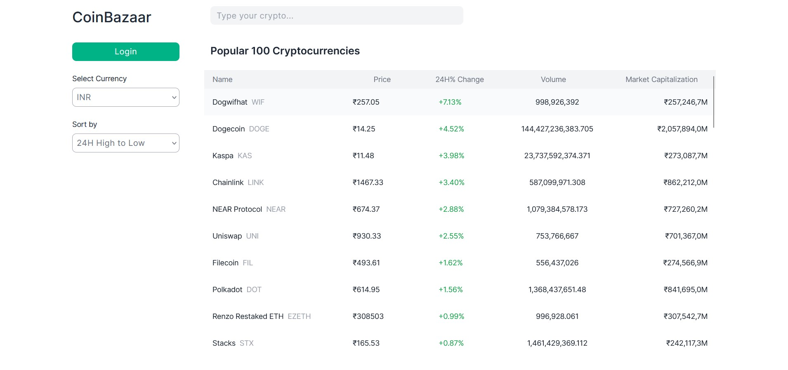
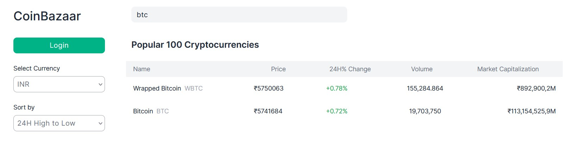
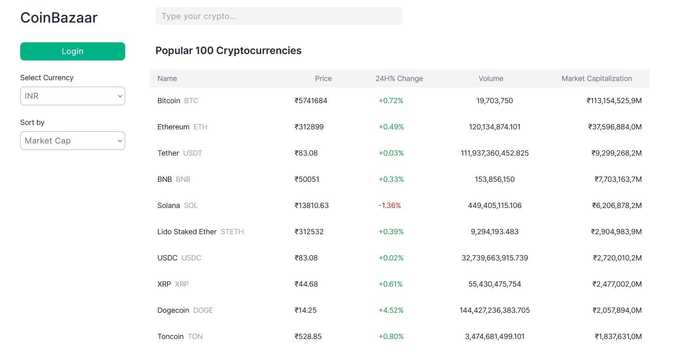
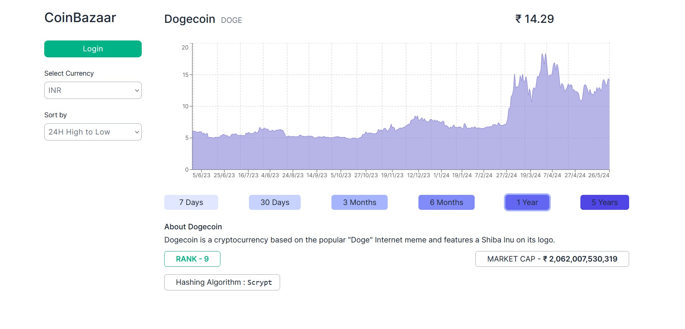

# Coin Bazaar

A web first platform to view and create baskets of cryptocurrencies.

# Live

Coin Bazaar is a web first app. View it on a PC.

View live: [coinbazaar-p88.vercel.app](https://coinbazaar-p88.vercel.app)

# Screenshots

### Home route (user not logged-in)

### Searching for crypto either using its Symbol or Currency Name

### Sorting popular cryptos based on market cap, 24H high to low, 24h low to high, A to Z, Z to A

### Single Crypto Data with details including the currency’s historical performance (/coins/bitcoin)

### To sort the historical performance data based on years (from 7 days to up to 5 years)

